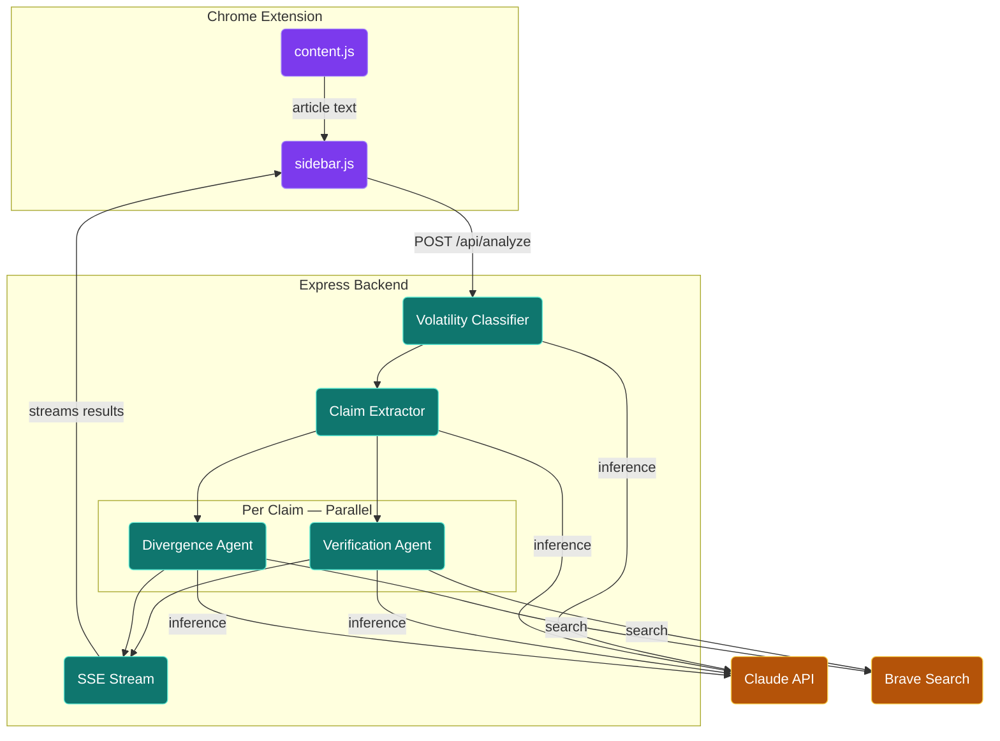

# VeritasAI

A Chrome extension that fact-checks the news article you're reading, in real time, without telling you what to think.

**[Try it on the Chrome Web Store →](https://chromewebstore.google.com/detail/veritasai/meihgjpilbhddfjoloampanbgmbmmnjj)**

---

## What it does

Open any news article and click the VeritasAI icon. The sidebar extracts the article's factual claims, verifies each one against live sources, and shows you confidence levels, cited sources, and how outlets across the political spectrum are framing the same underlying facts. No verdicts. No telling you what to think.

---

## Features

### Claim Extraction

Pulls 5-8 discrete factual claims from the article: statistics, attributed quotes, stated events, specific numbers. Vague assertions and opinion language get skipped.

Before claims load, the article gets classified as **News**, **Opinion/Editorial**, or **Analysis/Commentary**. Opinion and analysis pieces get a banner at the top of the sidebar.

---

### Per-Claim Verification

Each claim runs through an agentic search loop backed by live Brave Search results. The agent picks a query, reads the results, decides whether it has enough evidence or needs to refine and search again — up to 3 iterations per claim.

Every claim returns a confidence level with a one-sentence rationale:

| Level | Criteria |
|-------|----------|
| 🟢 **High** | 3+ independent sources confirm, or a primary source directly confirms with no credible contradictions |
| 🟡 **Medium** | Partial support, indirect evidence, mixed signals, or one credible contradiction |
| 🔴 **Low** | No sources confirm, active contradictions found, or results don't address the claim |
| ⬛ **No sources found** | Zero supporting and zero primary sources returned — claim may be unverifiable or newly reported |

---

### Primary Source Priority

Government data, wire dispatches, academic studies, court records, and institutional reports (WHO, UN, World Bank, SEC) get surfaced separately from media coverage — in their own section above the news source list on each claim card.

Media outlets, even highly reputable ones, are never categorized as primary sources. A Reuters article about a BLS report and the BLS report itself are different things.

---

### Political Lean Labels

Every source card shows the outlet's political lean — **Left, Lean Left, Center, Lean Right,** or **Right** — using Ad Fontes Media and AllSides data covering 100+ outlets.

The labels show where the support for a claim is coming from across the spectrum. A claim confirmed by outlets across the full lean range reads differently than one where all the supporting sources share the same label.

---

### Divergence Analysis

A second agent runs alongside the verification agent for each claim. It searches for coverage of the same fact across outlets with different lean labels and extracts each outlet's specific framing.

The output shows individual positions: CNN says X, Fox says Y, primary BLS data says Z. When outlets cite the same underlying statistic and build different stories from it, that shows up clearly.

---

### Bias Blindspot Detection

If 3 or more supporting sources for a claim all share the same political lean, a warning surfaces on the card:

> "All supporting sources are [Left/Right]-leaning — no opposing perspective found."

The 3-source threshold prevents false positives on claims with thin search results. Center and Unrated sources are excluded from the check.

---

### Volatility Classification

The article headline and opening paragraphs get classified as **Breaking**, **Developing**, or **Stable** before fact-checking starts.

- Breaking and Developing stories get a banner at the top of the sidebar
- Sources older than 12 hours in a breaking story trigger a one-notch confidence downgrade
- Sources older than 24 hours in a breaking story get visually muted on the card
- Every source card shows a relative timestamp (e.g. *5 hours ago*) pulled from the search API
- When publication dates are unavailable, recency adjustments are skipped

---

### More Features

| Feature | Description |
|---------|-------------|
| **Text Selection** | Highlight any sentence in the article to fact-check it on demand. Result gets inserted at the top of the claims list. |
| **Claim Highlighting** | Hover over a claim card to highlight the matching paragraph in the article. Scrolls into view if needed. |
| **Credibility Score** | A live percentage bar updates as each claim streams in. Green 75%+, yellow 40%+, orange below that. |
| **Streaming Results** | Claims appear in the sidebar as they finish. First result shows up within seconds. |
| **Shareable Links** | Generate a 7-day read-only link to the full fact-check. No extension required to view it. |

---

### Edge Cases

| Scenario | Behavior |
|----------|----------|
| Paywalled article | Fact-checks the visible text only |
| Opinion or editorial piece | Flagged at the top of the sidebar |
| Rounding or unit differences | Not treated as contradictions |
| Empty search results | Returns Low confidence with a `citation_needed` flag |

---

## How It Works

Two agents run concurrently per claim over Server-Sent Events: a verification agent that loops through Brave Search queries until it finds sufficient evidence, and a divergence agent that fetches coverage across the lean spectrum and extracts each outlet's specific framing. Results stream back to the sidebar as each claim resolves.

No hard verdicts. On politically sensitive claims, a confident wrong verdict with no sources is worse than no verdict at all. Confidence levels and cited sources let the reader evaluate the evidence themselves.

---

## Permissions

| Permission | Why |
|------------|-----|
| `activeTab` | Reads the URL and title of the tab you're currently on so the extension knows which article to analyze |
| `scripting` | Injects `content.js` into the page to extract the article body text |
| `sidePanel` | Opens the fact-check results in Chrome's native side panel |
| `storage` | Saves your API key and preferences locally so you don't have to re-enter them |
| `host_permissions: <all_urls>` | Allows `content.js` to run on any news site, not just a hardcoded list |

VeritasAI does not collect, transmit, or store your browsing history. The only data that leaves your browser is the article text sent to the backend for analysis.

---

## Credits

- AI: [Anthropic Claude](https://anthropic.com) (`claude-sonnet-4-20250514`)
- Web search: [Brave Search API](https://brave.com/search/api/)
- Source bias ratings: [Ad Fontes Media](https://adfontesmedia.com) and [AllSides](https://allsides.com)
