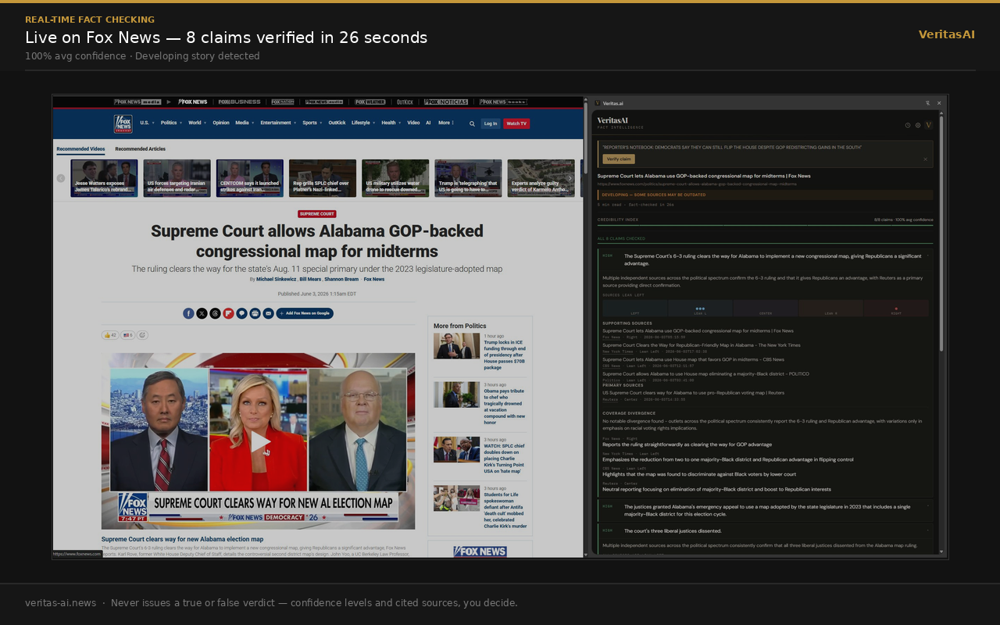
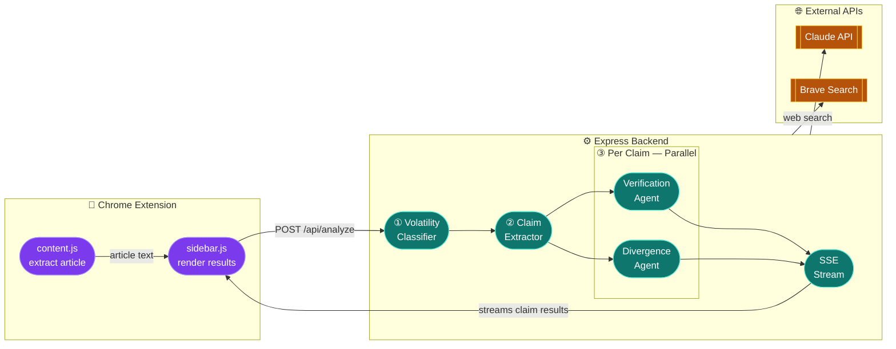

# VeritasAI

A Chrome extension that fact-checks the news article you're reading, in real time, without telling you what to think.

---

**[Try it on the Chrome Web Store](https://chromewebstore.google.com/detail/veritasai/meihgjpilbhddfjoloampanbgmbmmnjj)**

---

## Features

### Claim Extraction

VeritasAI reads the article and pulls out 5-8 discrete factual claims: statistics, attributed quotes, stated events, specific numbers. Vague assertions and opinion language get skipped. Before the claims load, the article gets classified as News, Opinion/Editorial, or Analysis/Commentary. Opinion and analysis pieces get a banner at the top of the sidebar flagging the piece type.

### Per-Claim Verification

Each claim runs through an agentic search loop backed by live Brave Search results. The agent picks a query, reads the results, and decides whether it has enough evidence or needs to search again. It runs up to 3 iterations per claim.

Each claim comes back with a confidence level and a one-sentence rationale explaining the score:

- **High:** 3+ independent sources confirm the claim, or a primary source directly confirms it with no credible contradictions
- **Medium:** partial support, indirect evidence, mixed signals, or one credible contradiction
- **Low:** no sources confirm the claim, active contradictions found, or results don't address it

Claims that return zero supporting sources and zero primary sources get a "No sources found" badge with a tooltip: "This claim may be unverifiable or newly reported."

### Primary Source Priority

Government data, AP and Reuters wire dispatches, academic studies, court records, WHO, UN, World Bank reports, and SEC filings get surfaced separately from media coverage, in their own section above the news source list on each claim card.

Media outlets, even highly reputable ones, are never categorized as primary sources. A Reuters article about a BLS report and the BLS report itself are different things and the sidebar treats them differently.

### Political Lean Labels

Every source card shows the outlet's political lean: Left, Lean Left, Center, Lean Right, or Right. Ratings come from Ad Fontes Media and AllSides public data, covering 100+ outlets.

The labels show you where the support for a claim is coming from across the spectrum. A claim confirmed by outlets across the full lean range reads differently than one where all the supporting sources share the same label.

### Divergence Analysis

A second agent runs alongside the verification agent for each claim. It searches for coverage of the same fact across outlets with different lean labels and extracts each outlet's specific framing. The output shows individual outlet positions: CNN says X, Fox says Y, primary BLS data says Z. When outlets cite the same underlying statistic and build different stories from it, that shows up clearly.

### Bias Blindspot Detection

After sources get lean-labeled, each claim card checks whether all the supporting sources share the same political lean. If 3 or more supporting sources are all Left/Lean Left, or all Right/Lean Right, a warning surfaces on the card: "All supporting sources are [Left/Right]-leaning — no opposing perspective found."

The 3-source threshold prevents false positives on claims with thin search results. Center and Unrated sources are excluded from the check.

### Volatility Classification

The article headline and opening paragraphs get classified as Breaking, Developing, or Stable before fact-checking starts.

Breaking and Developing stories get a banner at the top of the sidebar. Sources older than 12 hours in a breaking story trigger a one-notch confidence downgrade, with an explanation added to the rationale. Sources older than 24 hours in a breaking story get visually muted on the card. Every source card shows a relative timestamp pulled from the search API. When publication dates are unavailable, recency adjustments are skipped.

### Text Selection Fact-Checking

Highlight any sentence in the article and a popup appears in the sidebar offering to fact-check that specific text. The selected claim runs through the same verification pipeline in isolation, gets inserted at the top of the claims list, and inherits the article's current volatility classification.

### Claim Highlighting

Hover over any claim card and the matching paragraph in the article highlights on the page. It uses keyword-overlap scoring to find the best match and scrolls it into view.

### Article Credibility Score

A live credibility bar appears at the top of the results panel after the first claim resolves. It updates as each claim streams in. The formula averages High = 1.0, Medium = 0.5, Low = 0.0 across all resolved claims, shown as a color-coded percentage bar: green at 75%+, yellow at 40%+, orange below that. Claims that error out are excluded from the average.

### Streaming Results

Claims stream into the sidebar as each one finishes. The first result appears within a few seconds of opening the sidebar. A progress bar tracks how many claims have been checked.

### Shareable Fact-Check Links

After analysis completes, a "Copy share link" button appears at the bottom of the results panel. Clicking it generates a unique link to a read-only fact-check page that anyone can view without the extension. The page includes the credibility score, all claim cards with confidence badges, source lists, bias blindspot warnings, and divergence summaries. Links expire after 7 days.

### Edge Case Handling

- **Paywalled articles:** fact-checks the visible text only
- **Opinion pieces:** flagged at the top of the sidebar; rationale notes when a claim reflects the author's argument rather than an established fact
- **Contradictions:** time zone differences, unit differences, and rounding differences are not treated as contradictions
- **Empty search results:** returns Low confidence with a citation_needed flag

---

## How It Works

Two agents run concurrently per claim over Server-Sent Events: a verification agent that loops through Brave Search queries until it finds sufficient evidence, and a divergence agent that fetches coverage from outlets across the political lean spectrum and extracts their specific framing. Results stream back to the sidebar as each claim resolves.

VeritasAI shows no hard TRUE/FALSE verdicts. On politically sensitive claims, a confident wrong verdict with no sources is worse than no verdict at all. Confidence levels and cited sources let the reader evaluate the evidence themselves.

---

## Credits

- AI: [Anthropic Claude](https://anthropic.com) (`claude-sonnet-4-20250514`)
- Web search: [Brave Search API](https://brave.com/search/api/)
- Source bias ratings: [Ad Fontes Media](https://adfontesmedia.com) and [AllSides](https://allsides.com)
